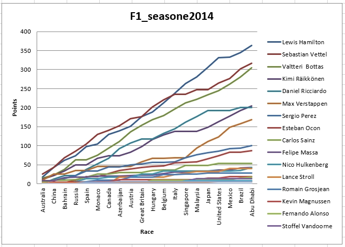

# F1_2014_pythonToExcel

Zadanie 1: Przygotuj arkusz o nazwie Standings, który będzie zawierał sumaryczną liczbę punktów zawodników po każdym wyścigu.

Arkusz powinien zawierać tabelą jak poniżej:
	                Australia 	China 	...
Lewis Hamilton 	         18 	   43 	...
Sebastian Vettel 	       25 	   43 	...
... 			

Zadanie 2: Na podstawie powyższej tabeli, w arkuszu Standings umieść wykres liniowy (LineChart), który zaprezentuje sumaryczną liczbę punktów po kolejnych wyścigach. Na osi X powinny być nazwy wyścigów, na osi Y liczba punktów, a serie reprezentują poszczególnych kierowców.

